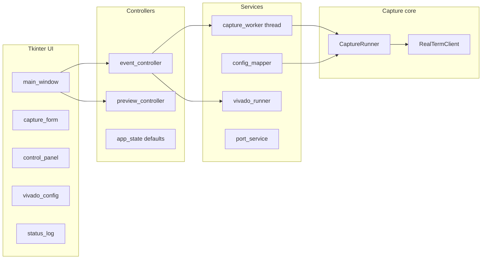

# PUF Capture GUI — User & Research Guide

This document describes the **PUF GUI** (window title: *PUF GUI*) used in the workflow for **“Characterizing Anderson PUF on FPGA.”** The application automates **serial capture** from the FPGA test setup via **RealTerm**, with **systematic filenames** that encode FPGA index, routing context (MDIST, MUX, LDIST, flip-flop site), or **CFF R1 initial-value** conditions. It also offers optional **Xilinx Vivado batch** helpers to **generate bitstreams** and **program the device**, separate from the capture loop.

---

## 1. Role in the research workflow

| Stage | What this tool does |
|--------|----------------------|
| **Bitstream / device** | Optionally launch Vivado in batch mode with your `.tcl` scripts (generate `.bit`, then program). |
| **Serial acquisition** | Connect to RealTerm over COM, open the port with your baud rate, and save terminal captures as `.txt` files. |
| **Structured naming** | Names files so sweeps (reliability, FF/MUX/LDIST grids, R1 init pairs) stay organized and traceable in analysis. |

The GUI does **not** replace Vivado implementation or post-processing scripts; it **coordinates RealTerm** and **standardizes output naming** for Anderson PUF characterization experiments.

---

## 2. How the application is built

### 2.1 Stack

- **Language:** Python 3.x  
- **UI:** Tkinter / `ttk` (`tkinter` is in the standard library).  
- **Windows integration:** `pywin32` — COM automation for **RealTerm** (`Realterm.RealtermIntf`).  
- **Vivado:** `subprocess` — invokes `vivado.bat` in **batch** mode with `-source` and `-tclargs` (see `ui/services/vivado_runner.py`).

### 2.2 Entry points

| Entry | Purpose |
|--------|---------|
| `run_gui.py` | Preferred: `python run_gui.py` |
| `RealTermControllerUI.py` | Legacy alias that starts the same app |

The main window class is `RealTermControllerApp` in `ui/main_window.py`.

### 2.3 High-level architecture



- **Views** (`ui/views/`): layout and widgets only.  
- **Controllers** (`ui/controllers/`): button handlers, validation via `parse_realterm_config`, Vivado launch.  
- **Worker thread** (`CaptureWorker`): runs `CaptureRunner.run_capture` so the UI stays responsive; status lines are queued to the log.  
- **Core** (`CaptureRunner.py`, `RealTermClient.py`, `capture_planners.py`, `RealTermNaming.py`): connection, job iteration, and filename rules.

### 2.4 Dependencies

Install from the repository root:

```powershell
python -m venv .venv
.\.venv\Scripts\Activate.ps1
python -m pip install -r requirements.txt
```

`requirements.txt` currently lists **`pywin32`** (RealTerm COM). No other pip packages are required for the GUI.

### 2.5 Prerequisites (runtime)

- **Windows** (COM and typical Vivado `.bat` paths).  
- **RealTerm** installed and registered so `Realterm.RealtermIntf` is available.  
- **Python 3.x** with the venv above.  
- For Vivado actions: **Xilinx Vivado** and valid paths to `vivado.bat`, your `.xpr`, `.tcl`, and `.bit` files.

### 2.6 Default form values

Initial field values (including example Vivado path and save directory) come from `AppDefaults` in `ui/controllers/app_state.py`. Adjust that dataclass if you want different defaults for your lab machines or paper experiments.

### 2.7 Tests

From the repo root:

```powershell
python -m unittest discover -s tests -v
```

---

## 3. Running the GUI

```powershell
.\.venv\Scripts\Activate.ps1
cd <path-to-PUFResponses>
python .\run_gui.py
```

The window is sized about **1000×800** (minimum **720×480**). Four areas matter:

1. **Capture Configuration** (left)  
2. **Control** (top right)  
3. **Vivado Configuration** (bottom right)  
4. **Status** (bottom, full width) — log output from capture and Vivado

---

## 4. Capture Configuration (naming modes)

Choose **Name mode** with the radio buttons:

### 4.1 Reliability (N captures) — **scheme1**

- Sweeps **capture indices** from **Start index** through **End index** for each FPGA in **[FPGA index … End FPGA index]**.  
- Filenames look like: `FPGA{n}_…_N{iii}.txt` (zero-padded three-digit index).  
- **Base name template** is normalized so the FPGA prefix matches the current FPGA in the loop.

Use this mode for **repeated captures** under the same configuration (e.g. noise / stability).

### 4.2 FF & MUX — **scheme3**

For **spatial / routing** characterization (flip-flop position, MDIST, MUX pair, LDIST case):

- **Flip-flop position:** DFF, CFF, BFF, AFF (when not auto-looping).  
- **MDIST / MUX pair:** Valid pairs depend on MDIST (see `RealTermNaming.MDIST_CASES`).  
- **LDIST case:** Dropdown of LUT pair + distance labels; maps to internal case IDs.  
- **Auto-loop** checkboxes (enabled in scheme3):  
  - **Auto-loop FF positions** — cycles DFF → CFF → BFF → AFF with fixed MUX/LDIST.  
  - **Auto-loop MDIST and mapped MUX pairs** — walks MDIST 8 down to 2 with valid MUX pairs.  
  - **Auto-loop LDIST cases** — walks all LDIST cases in a defined order.

Filenames encode **FPGA**, **MDIST**, **MUX endpoints**, **LDIST LUTs and distance**, and **FF position**, e.g.:

`FPGA7_…_MDIST8_M0_M7_DLUTA_ALUTB_LDIST6_DFF.txt`

(Exact pattern is built in `RealTermNaming.build_capture_filename`.)

Each **job step** can still run **Start index … End index** captures if you need multiple samples per setting.

### 4.3 Initial Values — **scheme4** (CFF R1 init)

For **Anderson-style initial-value** experiments on **CFF R1**:

- **Inital Values** dropdown: one of **12** fixed suffix tokens (`R1_INIT_PAIR_SUFFIXES` in `RealTermNaming.py`).  
- **Auto-loop all initial values (12 captures):** runs all 12 suffixes in order across the FPGA range.  
- **Start / End index** are forced to **1** for this mode internally (one capture per pair step).  
- **End FPGA index** is used for multi-FPGA sweeps.

Filename pattern (abbreviated):  
`FPGA{n}_LDIST6_DLUTA_ALUTB_MDIST8_M0_M7_CFF_R1_<suffix>.txt`  
One entry ends with a **literal `*`** in the stem (`5555_AAAA*`).

### 4.4 Other capture fields

| Field | Role |
|--------|------|
| **COM port** | Select port; **Refresh** rescans. Labels are mapped to port numbers in `port_service`. |
| **Baud rate** | Serial speed (e.g. 115200). |
| **Result directory** | Where `.txt` captures are written (created if missing). |
| **Auto delay (s)** | Wait after you trigger **Capture** and before starting RealTerm capture (useful for settling). |
| **File Name Preview** | Live preview from `PreviewController` / filename rules. |

---

## 5. Control panel

| Control | Action |
|---------|--------|
| **Connect to RealTerm** | Validates configuration, starts **background worker**, connects COM, runs the **job planner** loop for the selected naming mode. |
| **Disconnect RealTerm** | Stops the worker and closes the RealTerm port when possible. |
| **Capture** | While connected, signals the worker to proceed past the “wait for trigger” for the **next** scheduled capture. |

**Important:** After **Connect**, the tool waits for **Capture** between steps (manual pacing). The **Status** log shows headings such as `--- FF & MUX Step k / N ---` or `=== Reliability FPGA … ===`.

State label: **Idle** vs **Running** (while the capture session is active).

---

## 6. Vivado Configuration

Paths are plain text fields plus **Browse…** where applicable.

| Field / action | Purpose |
|----------------|---------|
| **Vivado bat path** | e.g. `...\bin\vivado.bat` |
| **Vivado project (.xpr)** | Project file passed as the first `-tclargs` argument after the TCL script path in the constructed command. |
| **Generate Bitstream TCL** | TCL for synthesis/implementation/bitgen (your lab script). |
| **Generate Bitstream** button | Runs batch Vivado with that TCL. |
| **Bitstream to program (.bit)** | Path to the `.bit` for programming. |
| **Programming Device TCL** | TCL that programs the device; the GUI passes the **.bit path** as **additional** `tclargs` after the `.xpr`. |
| **Programming Device** button | Runs that flow. |

Vivado **stdout** is streamed into **Status** with tags like `[Vivado:GenerateBitstream]` and `[Vivado:ProgrammingDevice]`. Only one Vivado run at a time; **Generate** / **Programming** buttons disable while a run is active.

Exact command line: `ui/services/vivado_runner.build_vivado_command`.

---

## 7. Typical experimental workflows

### 7.1 Reliability / repeated capture

1. Set **Name mode** → **Reliability (N captures)**.  
2. Set FPGA range, indices, COM, baud, **Result directory**, optional **Auto delay**.  
3. **Connect to RealTerm**.  
4. Press **Capture** for each file (or per step if multiple indices).

### 7.2 FF / MUX / LDIST grid

1. **Name mode** → **FF & MUX**.  
2. Configure manual selections **or** enable one or more **Auto-loop** options.  
3. Connect and use **Capture** to advance through the generated job list.

### 7.3 CFF R1 initial values (paper-focused)

1. **Name mode** → **Initial Values**.  
2. Choose one **R1** pair **or** enable **Auto-loop all initial values**.  
3. Set **FPGA index** / **End FPGA index** for multi-board or multi-die style sweeps.  
4. Connect and **Capture** per step.

### 7.4 Vivado then capture

1. Fill **Vivado Configuration**, run **Generate Bitstream** then **Programming Device** as needed.  
2. Configure **Capture Configuration** and run serial captures as above.

---

## 8. Output data

- **Format:** `.txt` files (RealTerm capture; extension is fixed in validation).  
- **Location:** **Result directory** from the form.  
- **Naming:** Determined by `RealTermNaming.build_capture_filename` and the active `RealTermConfig` for each job step.

For reproducibility in a paper, record: naming mode, FPGA range, index range (scheme1/3), R1 suffix list (scheme4), COM/baud, auto-delay, and Vivado script versions if you used the GUI to launch them.

---

## 9. Troubleshooting

| Issue | What to check |
|--------|----------------|
| Connect fails / invalid configuration | Dialog text; ensure base name, COM, baud, save dir, and mode-specific fields (MUX/LDIST/R1) are valid. |
| RealTerm errors | RealTerm installed; not blocked by another program using the same COM port. |
| Capture ignored | Must be **connected** (`Capture` stays disabled until then). |
| Vivado launch errors | `.bat` / `.xpr` / `.tcl` exist; paths correct; for programming, `.bit` exists and path ends with `.bit`. |
| Quit while capturing | Close window → prompt to stop and quit; worker is asked to stop. |

Legacy or one-off scripts live under `scripts/legacy/` and are **not** required for the main GUI path.

---

## 10. File map (quick reference)

| Path | Role |
|------|------|
| `run_gui.py` | GUI entry |
| `ui/main_window.py` | Window layout, worker queue, preview traces |
| `ui/views/capture_form.py` | Capture form widgets |
| `ui/views/control_panel.py` | Connect / Disconnect / Capture |
| `ui/views/vivado_config.py` | Vivado fields and action buttons |
| `ui/controllers/event_controller.py` | Handlers, Vivado subprocess thread |
| `ui/controllers/app_state.py` | `AppDefaults` |
| `ui/services/capture_worker.py` | Thread wrapper for `run_capture` |
| `ui/services/config_mapper.py` | Form → `RealTermConfig` |
| `ui/services/vivado_runner.py` | Vivado CLI construction |
| `CaptureRunner.py` | Orchestrates RealTerm + planners |
| `capture_planners.py` | Iterators over reliability / FF-MUX-LDIST / R1 jobs |
| `RealTermClient.py` | COM control of RealTerm |
| `RealTermNaming.py` | Filename rules, MDIST/LDIST/R1 tables |
| `RealTermTypes.py` | `RealTermConfig` dataclass |

---

*This guide matches the repository layout and behavior at the time of writing. For minimal install/run instructions, see `README.md`.*
