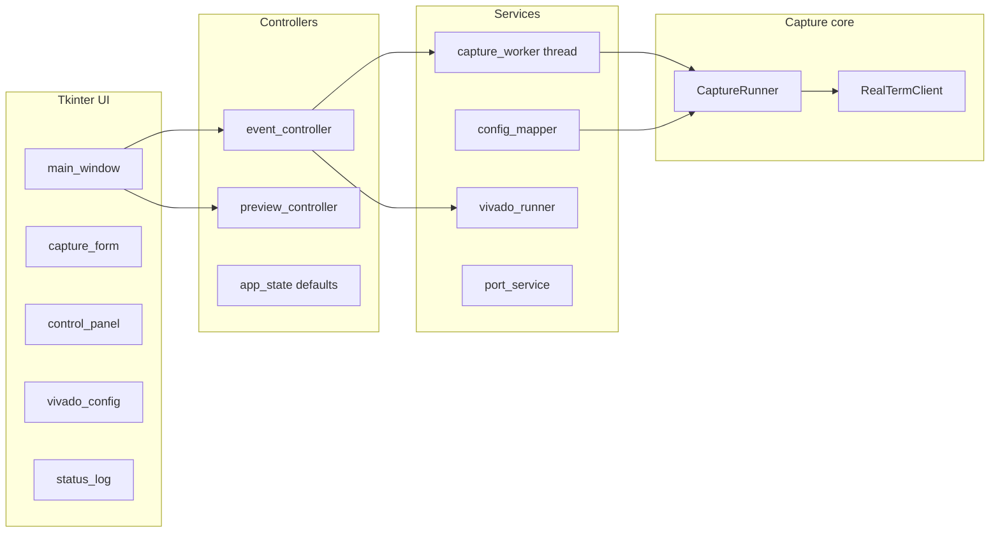

# PUFResponses (RealTerm Capture Controller)

Small **Tkinter GUI** for **“Characterizing Anderson PUF on FPGA”**: control **RealTerm** over COM, save serial captures as `.txt` with **consistent filenames** (reliability sweeps, FF/MUX/LDIST grids, CFF R1 initial-value pairs), and optionally drive **Xilinx Vivado** in batch mode to **generate a bitstream** and **program the device**.

The GUI **coordinates RealTerm** and **standardizes naming**; it does not replace Vivado RTL/constraints or offline analysis scripts.

---

## Quick start

### Prerequisites

- **Windows** (COM and typical Vivado `.bat` layout)
- **RealTerm** installed (`Realterm.RealtermIntf`)
- **Python 3.x**

### Setup

```powershell
python -m venv .venv
.\.venv\Scripts\Activate.ps1
python -m pip install -r requirements.txt
```

`requirements.txt` lists **`pywin32`** (RealTerm COM). No other pip packages are required for the GUI.

For Vivado actions you also need **Xilinx Vivado** and valid paths to `vivado.bat`, your `.xpr`, `.tcl`, and `.bit` files.

### Run (GUI)

From the repo root:

```powershell
.\.venv\Scripts\Activate.ps1
python .\run_gui.py
```

Legacy entrypoint (same app):

```powershell
python .\RealTermControllerUI.py
```

The window title is **PUF GUI**; size is about **1000×800** (minimum **720×480**).

### Tests

```powershell
python -m unittest discover -s tests -v
```

---

## Role in the research workflow

| Stage | What this tool does |
|--------|----------------------|
| **Bitstream / device** | Optionally launch Vivado in batch mode with your `.tcl` scripts (generate `.bit`, then program). |
| **Serial acquisition** | Connect to RealTerm over COM, open the port at your baud rate, and save terminal captures as `.txt` files. |
| **Structured naming** | Names files so sweeps (reliability, FF/MUX/LDIST grids, R1 init pairs) stay organized and traceable in analysis. |

---

## How the application is built

### Stack

- **Language:** Python 3.x
- **UI:** Tkinter / `ttk` (stdlib)
- **Windows:** `pywin32` — COM for **RealTerm** (`Realterm.RealtermIntf`)
- **Vivado:** `subprocess` — `vivado.bat` in **batch** mode with `-source` and `-tclargs` (`ui/services/vivado_runner.py`)

### Entry points

| Entry | Purpose |
|--------|---------|
| `run_gui.py` | Preferred |
| `RealTermControllerUI.py` | Legacy alias |

Main window class: `RealTermControllerApp` in `ui/main_window.py`.

### High-level architecture



- **Views** (`ui/views/`): layout and widgets
- **Controllers** (`ui/controllers/`): handlers, `parse_realterm_config`, Vivado launch
- **Worker** (`CaptureWorker`): runs `CaptureRunner.run_capture` on a thread; status lines go to the log queue
- **Core** (`CaptureRunner.py`, `RealTermClient.py`, `capture_planners.py`, `RealTermNaming.py`): connection, job iteration, filenames

### Default form values

`AppDefaults` in `ui/controllers/app_state.py` sets initial fields (example Vivado path, save directory, etc.). Edit that dataclass for your lab machines or paper runs.

---

## GUI layout

Four main areas:

1. **Capture Configuration** (left)
2. **Control** (top right)
3. **Vivado Configuration** (bottom right)
4. **Status** (bottom, full width) — capture and Vivado log output

---

## Capture configuration (naming modes)

Use the **Name mode** radio buttons.

### Reliability (N captures) — scheme1

- Sweeps **Start index** … **End index** for each FPGA in **FPGA index** … **End FPGA index**
- Filenames: `FPGA{n}_…_N{iii}.txt` (three-digit index)
- **Base name template** is normalized so the FPGA prefix matches the FPGA in the current loop

Use for **repeated captures** under the same configuration (e.g. noise / stability).

### FF & MUX — scheme3

**Spatial / routing** characterization (flip-flop, MDIST, MUX pair, LDIST case):

- **Flip-flop:** DFF, CFF, BFF, AFF (when not auto-looping)
- **MDIST / MUX:** valid pairs per MDIST (`RealTermNaming.MDIST_CASES`)
- **LDIST case:** dropdown labels → internal case IDs
- **Auto-loop** (scheme3 only):
  - **Auto-loop FF positions** — DFF → CFF → BFF → AFF
  - **Auto-loop MDIST and mapped MUX pairs** — MDIST 8 down to 2 with valid MUX pairs
  - **Auto-loop LDIST cases** — all cases in a fixed order

Example filename shape: `FPGA7_…_MDIST8_M0_M7_DLUTA_ALUTB_LDIST6_DFF.txt` (see `RealTermNaming.build_capture_filename`).

Each job step can still run multiple indices if **Start** / **End index** span more than one capture.

### Initial Values — scheme4 (CFF R1 init)

**Anderson-style initial-value** experiments on **CFF R1**:

- **Inital Values** dropdown: one of **12** suffix tokens (`R1_INIT_PAIR_SUFFIXES` in `RealTermNaming.py`)
- **Auto-loop all initial values (12 captures):** all 12 suffixes in order across the FPGA range
- **Start / End index** are forced to **1** internally (one capture per pair step)
- **End FPGA index** supports multi-FPGA sweeps

Filename pattern (abbreviated): `FPGA{n}_LDIST6_DLUTA_ALUTB_MDIST8_M0_M7_CFF_R1_<suffix>.txt`  
One suffix includes a **literal `*`** in the stem (`5555_AAAA*`).

### Other capture fields

| Field | Role |
|--------|------|
| **COM port** | **Refresh** rescans; labels map to port numbers (`port_service`) |
| **Baud rate** | e.g. 115200 |
| **Result directory** | Output folder for `.txt` (created if missing) |
| **Auto delay (s)** | Wait after **Capture** before starting capture (settling) |
| **File Name Preview** | Live preview (`PreviewController` + naming rules) |

---

## Control panel

| Control | Action |
|---------|--------|
| **Connect to RealTerm** | Validates config, starts worker, opens COM, runs the job planner for the selected mode |
| **Disconnect RealTerm** | Stops worker and closes the RealTerm port when possible |
| **Capture** | While connected, advances past “wait for trigger” for the **next** scheduled capture |

After **Connect**, the tool waits for **Capture** between steps (**manual pacing**). **Status** shows headings like `--- FF & MUX Step k / N ---` or `=== Reliability FPGA … ===`.

**Idle** / **Running** reflects whether a capture session is active.

---

## Vivado configuration

| Field / action | Purpose |
|----------------|---------|
| **Vivado bat path** | e.g. `...\bin\vivado.bat` |
| **Vivado project (.xpr)** | Passed in `-tclargs` (after the TCL script path in the built command) |
| **Generate Bitstream TCL** | Your synthesis/implementation/bitgen script |
| **Bitstream output name (optional)** | When non-empty, passed as a **second** `-tclargs` value after the `.xpr` path (same mechanism as programming’s extra arg). In Tcl use e.g. `[lindex $argv 0]` for the project and `[lindex $argv 1]` when `[llength $argv] > 1`; if the field is empty, only the project path is passed (backward compatible). |
| **Generate Bitstream** | Runs batch Vivado with that TCL |
| **Bitstream to program (.bit)** | Bitstream path for programming |
| **Programming Device TCL** | Programming script; GUI adds the **.bit path** as extra `tclargs` after the `.xpr` |
| **Programming Device** | Runs that flow |

Vivado **stdout** appears in **Status** as `[Vivado:GenerateBitstream]` / `[Vivado:ProgrammingDevice]`. Only one Vivado run at a time; action buttons disable while it runs.

Command construction: `ui/services/vivado_runner.build_vivado_command`.

---

## Typical workflows

**Reliability / repeated capture:** Name mode **Reliability** → set FPGA range, indices, COM, baud, directory, optional delay → **Connect** → **Capture** per file/step.

**FF / MUX / LDIST grid:** Name mode **FF & MUX** → manual settings and/or **Auto-loop** options → **Connect** → **Capture** through the job list.

**CFF R1 initial values:** Name mode **Initial Values** → one R1 pair or **Auto-loop all** → set FPGA range → **Connect** → **Capture** per step.

**Vivado then capture:** Fill **Vivado Configuration**, run **Generate Bitstream** / **Programming Device** as needed, then run serial captures as above.

---

## Output data

- **Format:** `.txt` (RealTerm; extension fixed in validation)
- **Location:** **Result directory**
- **Naming:** `RealTermNaming.build_capture_filename` + per-step `RealTermConfig`

For a paper, record: naming mode, FPGA range, index range (scheme1/3), R1 suffix set (scheme4), COM/baud, auto-delay, and Vivado script revisions if launched from the GUI.

---

## Troubleshooting

| Issue | What to check |
|--------|----------------|
| Connect / invalid configuration | Dialog text; base name, COM, baud, save dir, MUX/LDIST/R1 fields |
| RealTerm errors | Installation; COM port not in use elsewhere |
| Capture ignored | Must be **connected** first |
| Vivado errors | `.bat` / `.xpr` / `.tcl` exist; programming needs a real `.bit` path |
| Quit while capturing | Close prompts to stop; worker is stopped |

---

## Project layout (quick reference)

| Path | Role |
|------|------|
| `run_gui.py` | GUI entry |
| `ui/main_window.py` | Layout, worker queue, preview traces |
| `ui/views/capture_form.py` | Capture form |
| `ui/views/control_panel.py` | Connect / Disconnect / Capture |
| `ui/views/vivado_config.py` | Vivado fields and buttons |
| `ui/controllers/event_controller.py` | Handlers, Vivado subprocess thread |
| `ui/controllers/app_state.py` | `AppDefaults` |
| `ui/services/capture_worker.py` | Thread wrapper for `run_capture` |
| `ui/services/config_mapper.py` | Form → `RealTermConfig` |
| `ui/services/vivado_runner.py` | Vivado CLI |
| `CaptureRunner.py` | RealTerm + planners |
| `capture_planners.py` | Reliability / FF-MUX-LDIST / R1 job iterators |
| `RealTermClient.py` | RealTerm COM |
| `RealTermNaming.py` | Filenames, MDIST/LDIST/R1 tables |
| `RealTermTypes.py` | `RealTermConfig` |

Legacy or experimental scripts: `scripts/legacy/` (not required for the main GUI).

---

*README matches the repository layout and behavior at the time of writing.*
